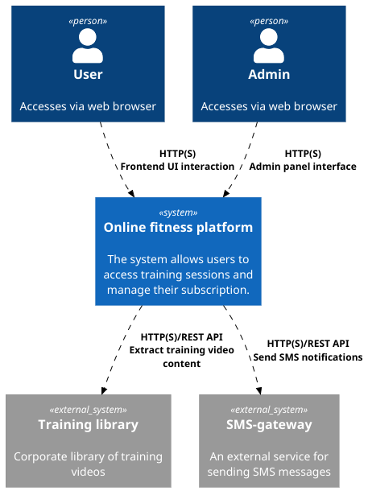
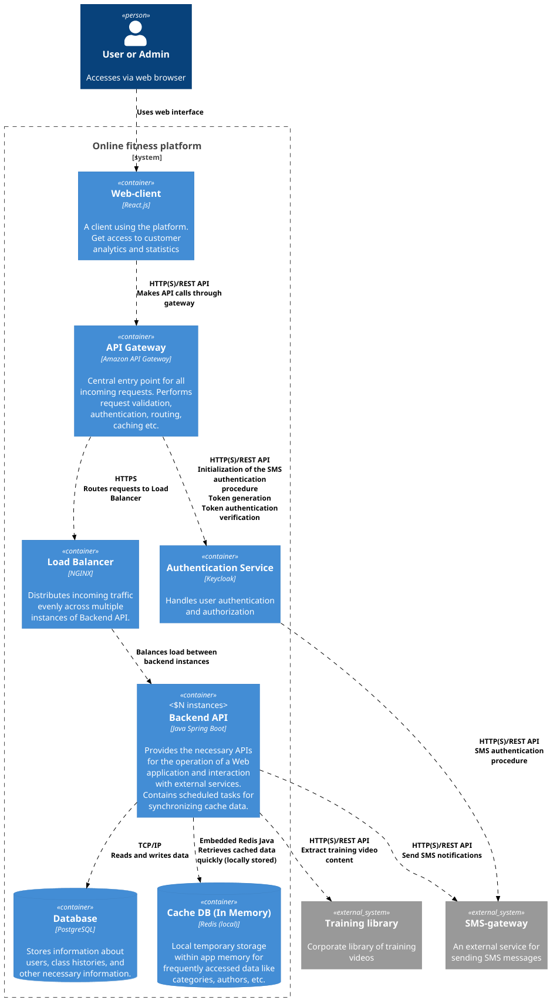
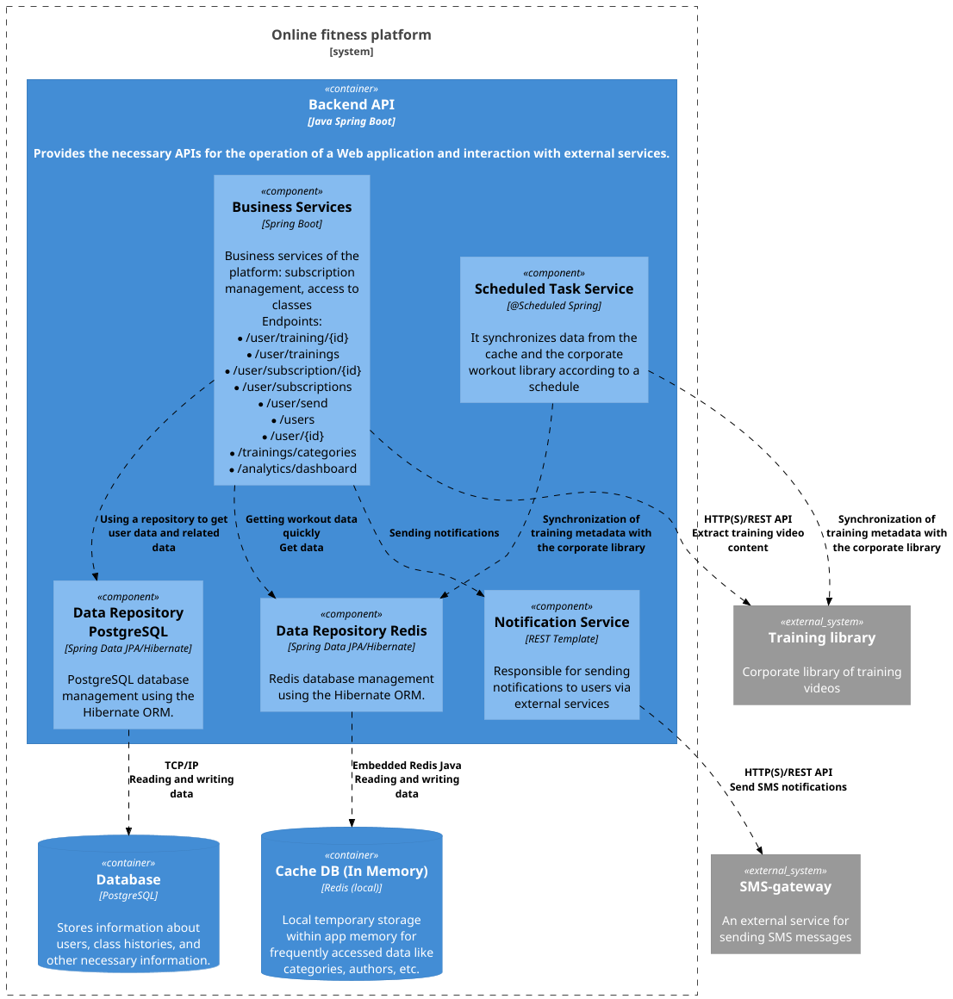
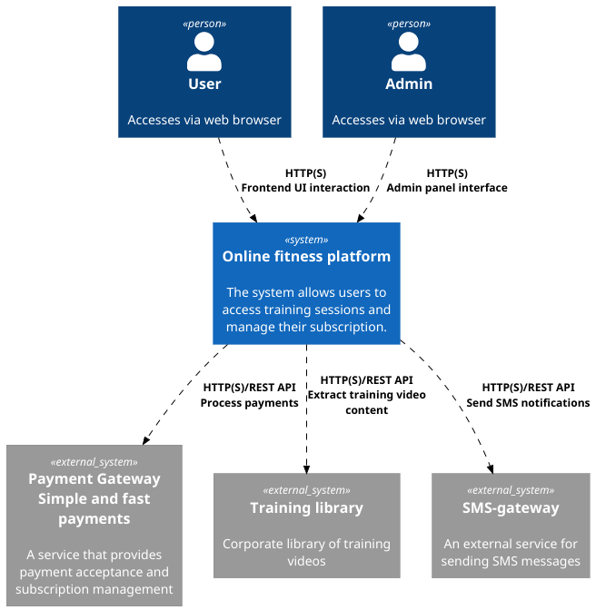
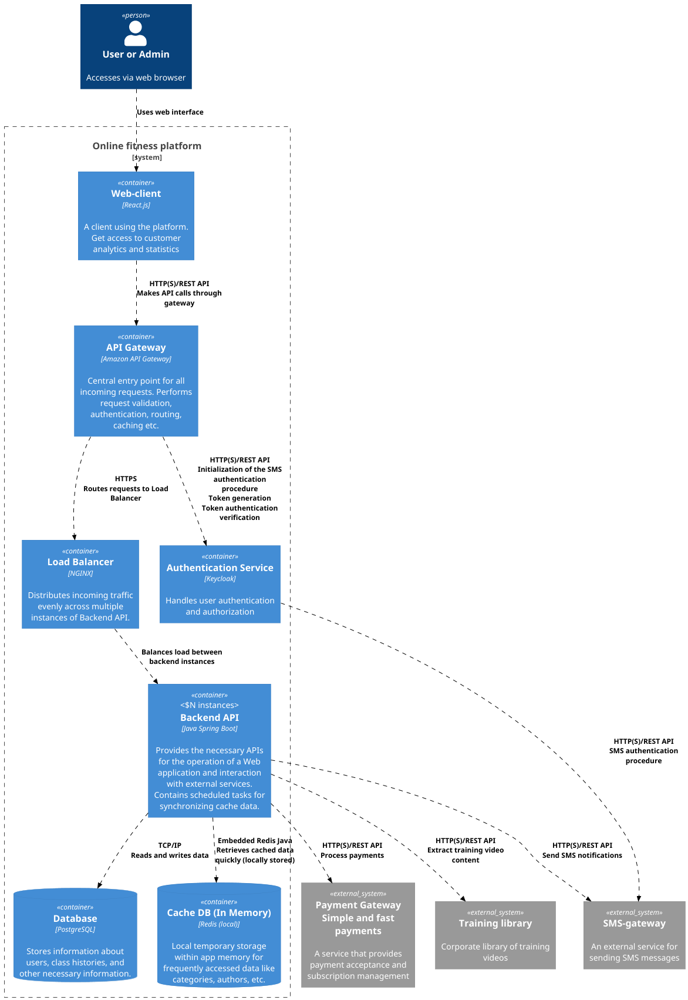
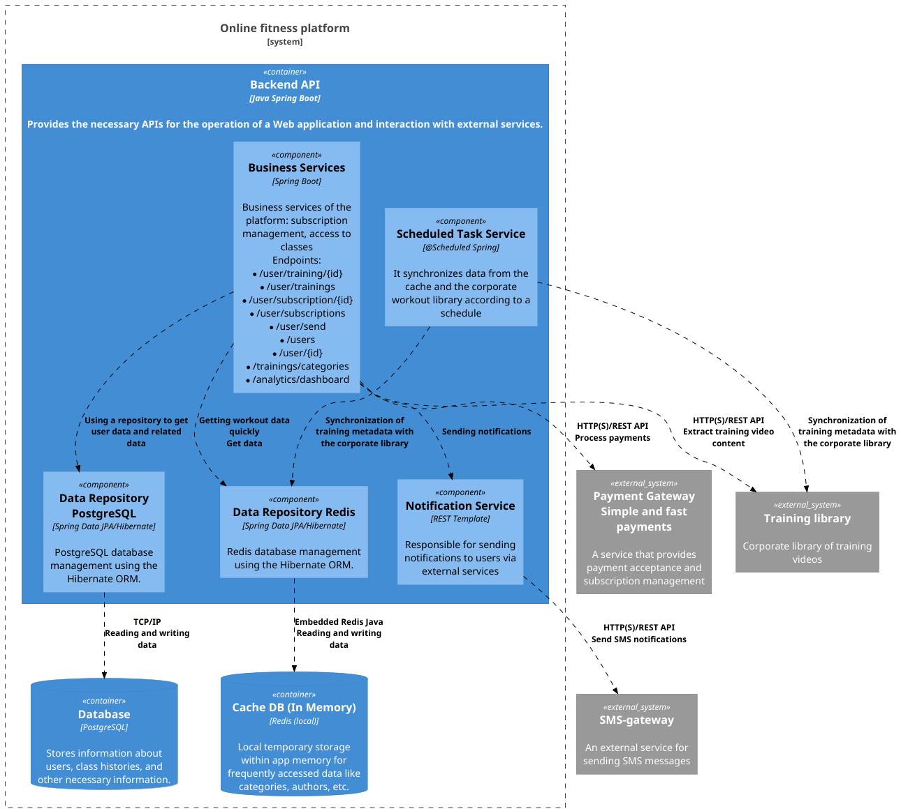

# OnlineFitnessPlatform

### The PlantUML4Idea plugin is used to integrate PlantUML into IntelliJ IDEA
### https://plugins.jetbrains.com/plugin/7017-plantuml4idea

## MVP Context Diagram

## MVP Container Diagram

## MVP Component Diagram

## Beta Context Diagram

## Beta Container Diagram

## Beta Component Diagram
